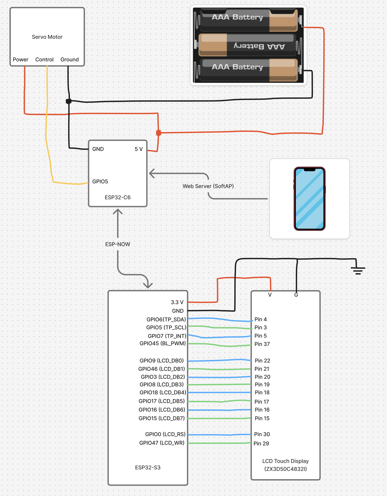
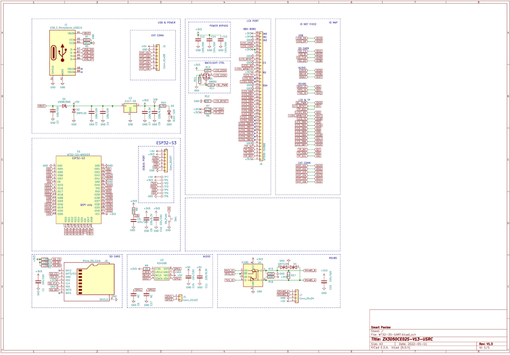

# ECE4180_FinalProject

ECE 4180 Final Project Report: Door Auto-Locker

Team Members:
- Sheev Shah
- Shivam Patel

1. Project Overview - What our project does

Our project is a smart door auto-locker designed to automatically lock and unlock an apartment’s deadbolt without requiring any modification to the existing lock hardware.
Unlike commercial smart locks that require uninstalling the original deadbolt, our solution is fully external and quickly installable. 
The device sits on top of the deadbolt and physically rotates it using a servo motor controlled by an ESP32.

The user can lock or unlock the door using:
- A phone/laptop
  - The ESP32 acts as a Wi-Fi Soft Access Point
  - The user connects to the ESP32’s Wi-Fi and opens a webpage
  - The webpage shows Door Locked / Door Unlocked and a color-coded button to toggle the state
- An LCD touchscreen interface
  - The second ESP32 controls a touch LCD
  - A “Lock” or “Unlock” button appears on the screen
  - Pressing the button sends a signal (via Bluetooth/ESP-NOW) to the motor-controlling ESP32
- Automatic locking
  - If the door is left unlocked for 10 seconds, the system automatically re-locks it

2. Hardware components and their roles
- Two ESP32 Microcontrollers
  - One ESP32 handles motor control, Wi-Fi access point, and the web interface
  - The second ESP32 manages the LCD touch display
  - They communicate using ESP-NOW / Bluetooth
- LCD Touch Display (new part not covered in labs)
  - Displays the real-time lock status
  - Allows the user to tap on-screen lock/unlock buttons
  - Communicates with the main ESP32 via I2C
- Wi-Fi Soft Access Point
  - Allows a phone/laptop to join the ESP32’s Wi-Fi network
  - Serves a webpage showing:
    - Door state
    - Green “Unlock Door” button
    - Red “Lock Door” button
  - Provides a second way to control the lock wirelessly
- Servo Motor and Motor Driver
  - Physically rotates the deadbolt
  - Controlled via PWM output from one ESP32
  - The motor driver ensures the servo receives stable power
- Sleep Mode
  - LCD touch display enters deep sleep if not touched for 10 seconds
- Battery Power
  - The ESP32 mounted on the door is battery-powered
- Interrupts
  - Used to detect:
    - Touchscreen button press
    - Incoming ESP-NOW messages
    - Distance sensor events

3. Project Challenges
- One of the biggest challenges in this project was getting ESP-NOW and Wi-Fi to run at the same time on the ESP32-C6. By default, ESP-NOW expects the device to operate in station mode, while my project also required SoftAP mode so a phone could connect to the webpage. This caused conflicts with channel settings and prevented messages from being received consistently. After debugging, I learned that the ESP must be placed in WIFI_AP_STA mode and locked to a single Wi-Fi channel before initializing ESP-NOW. Once those settings were configured correctly, both the web interface and the ESP-NOW communication with the LCD/ESP32-S3 worked together reliably.
- Another large challenge that we came across was getting the LCD to interface with the ESP32S3 module that we had gotten. This was our first time working with a module that utilized an 8080 8Bit Bus so there was a little bit of a learning curve especially considering the drivers that we were able to find were all documented in a language that neither of us spoke.

4. How our design differs from existing smart locks
Most commercial smart locks require:
  - Removing your existing deadbolt
  - Drilling holes in the door
  - Full mechanical installation
  - Permanent modification to the apartment

Our design:
  - Fully external attaching mechanism
  - No modification to the door
  - Installs in minutes
  - Works with the existing deadbolt
  - Significantly cheaper (uses ESP32 and servo)
  - Dual control system (phone and touchscreen)
  - Automatically locks itself after 30 seconds

5. What we would add with more time/resources
- Smartphone App (iOS + Android)
  - Instead of using a webpage
  - Include notifications: “Your door auto-locked!”
- Home assisstant / Google home integration
  - Integrate with existing smart home platforms
  - Allow voice commands: “Hey Google, lock my door.”
- Add a secret pin
  - People with the pin can have access to unlocking/locking the door.

Diagram:

ESP32S3:

Links:
1. Wi-Fi and ESP-NOW:
- https://docs.arduino.cc/libraries/wifi/
- https://github.com/pycom/pycom-esp-idf/blob/master/components/esp32/include/esp_wifi.h
- https://github.com/espressif/esp-now/blob/master/src/espnow/include/espnow.h
2. Servo:
- https://docs.arduino.cc/libraries/esp32servo/
   - https://github.com/madhephaestus/ESP32Servo
3. SensorLib: 
- https://github.com/lewisxhe/SensorLib/blob/master/examples/TouchDrv_FT6232_GetPoint/TouchDrv_FT6232_GetPoint.ino
4. LGFX: 
- https://github.com/lovyan03/LovyanGFX/blob/master/examples/HowToUse/1_simple_use/1_simple_use.ino
- https://github.com/lovyan03/LovyanGFX/blob/master/examples/HowToUse/3_fonts/3_fonts.ino
5. DEEP Sleep:
- https://github.com/lovyan03/LovyanGFX/blob/master/examples/Advanced/ESP32DeepSleepDisplay/ESP32DeepSleepDisplay.ino
6. Interrupt:
- https://docs.espressif.com/projects/arduino-esp32/en/latest/api/gpio.html
